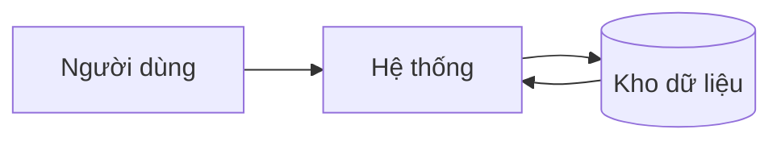
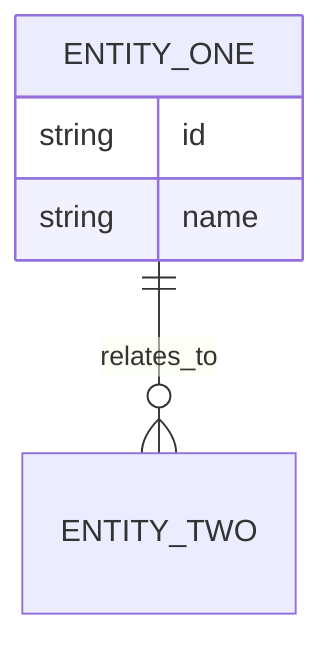

> **Tài liệu tổng hợp:** Compile tự động từ canon sources lúc 2026-06-08 05:27:22 UTC.
> Module: auth | Slug: example | Date: 260528-1000
> Sources: srs/spec.md, usecases/index.md, usecases/uc-login.md, ascii-screen/index.md, ascii-screen/scr-01-login.md

# Đặc tả yêu cầu phần mềm (Software Requirements Specification)

> **Tài liệu tổng hợp:** Tài liệu này là bản SRS đọc/handoff cho stakeholder. Khi dự án dùng tài liệu nguồn chuẩn, nguồn chỉnh sửa chính nằm ở `usecases/*.md`, `ascii-screen/*.md`, `srs/spec.md`, `srs/flows.md`, `srs/states.md`, và `srs/erd.md`; sau đó tổng hợp lại vào `srs.md`. ASCII wireframe bắt buộc nằm trong từng `ascii-screen/*.md` và được tổng hợp vào đây. Không chỉnh trực tiếp `srs.md` trừ khi có manual override và backport vào tài liệu nguồn chuẩn.

## Tóm tắt dành cho BA và stakeholder

> Phần này được tổng hợp tự động khi chạy `ba-start srs`. Không chỉnh sửa trực tiếp vì nội dung được lấy từ tài liệu nguồn chuẩn.

**Dự án (Project):** [Tên dự án]
**Phiên bản (Version):** [v1.0]
**Chủ sở hữu (Owner):** [BA/technical owner]
**Ngày (Date):** [YYYY-MM-DD]

## Mục đích và phạm vi (Purpose and Scope)
Nêu phạm vi phần mềm, ranh giới hệ thống, và đối tượng đọc.

## Mô tả tổng quan (Overall Description)
- Góc nhìn sản phẩm:
- Nhóm người dùng:
- Môi trường vận hành:
- Giả định và phụ thuộc:

## Kiến trúc hệ thống & Điều hướng (Information Architecture)
Liệt kê các Portal/App trong hệ thống, đối tượng mục tiêu, và cấu trúc Menu (Sitemap) tương ứng để đảm bảo sự nhất quán trong thiết kế UI/UX và phân quyền.

### Ma trận portal (Portal Matrix)

| Portal ID | Portal / App | Đối tượng mục tiêu (Target Actor) | Access Scope | Owned Screen Families / Route Groups | Default Entry Context |
| --- | --- | --- | --- | --- | --- |
| [PORTAL-ADMIN] | [Admin Portal] | [System Admin] | [Full admin] | [Dashboard, User Management, Settings] | [Sau login vào Dashboard] |

### Navigation Schema

| Portal ID | Nav Schema ID | Menu chính (Sitemap) | Pattern điều hướng | Default Landing | Active / Selected Rule | Breadcrumb / Back Rule | Hidden / Contextual Nav Exceptions |
| --- | --- | --- | --- | --- | --- | --- | --- |
| [PORTAL-ADMIN] | [NAV-ADMIN-01] | - Dashboard<br>- Quản lý người dùng<br>- Cài đặt | [Sidebar] | [Dashboard] | [Highlight item theo route group] | [Breadcrumb từ cấp 2 trở xuống] | [Modal xác nhận không render menu] |
| [PORTAL-CUSTOMER] | [NAV-CUSTOMER-01] | - Home<br>- Đơn hàng<br>- Tài khoản | [Bottom tabs] | [Home] | [Bottom tab active theo tab hiện tại] | [Back theo native/browser history] | [Checkout step có thể ẩn tabs] |

## Yêu cầu chức năng (Functional Requirements)
| Mã (ID) | Yêu cầu (Requirement) | Ưu tiên (Priority) | Nguồn (Source) | Tiêu chí chấp nhận (Acceptance Criteria) |
| --- | --- | --- | --- | --- |
| FR-auth-001 | User login với email/password | Must | Backbone | Login thành công trong 3 lần thử |
| FR-auth-002 | Hiển thị thông báo lỗi khi sai password | Must | Backbone | Hiển thị "Sai mật khẩu" sau lần thử thứ 3 |
## Đặc tả Use Case (Use Case Specifications)
| Mã UC (Use Case ID) | Tên UC (Use Case Name) | Tác nhân chính (Primary Actor) | Trigger | Điều kiện tiên quyết (Precondition) | Hậu điều kiện (Postcondition) |
| --- | --- | --- | --- | --- | --- |
| UC-login | User Login | User | TBD | TBD | TBD |

## UC-login: User Login

**Mã UC (Use Case ID):** UC-login
**Mục tiêu (Goal):** User xác thực vào hệ thống bằng email/password
**Tác nhân chính (Primary Actor):** User

| Bước (Step) | Hành động tác nhân (Actor Action) | Phản hồi hệ thống (System Response) |
| --- | --- | --- |
| 1 | User nhập email và password | Hệ thống hiển thị form đăng nhập |
| 2 | User nhấn "Đăng nhập" | Hệ thống kiểm tra thông tin và chuyển đến Dashboard |

**Màn hình liên kết (Linked Screen):** SCR-01 — Login Screen
## Hợp đồng màn hình tiền wireframe (Screen Contract Plus)
Ghi nhận screen spec đủ mạnh để chuẩn bị constraint wireframe trước khi viết mô tả màn hình chi tiết. Phần này khóa portal ownership và menu behavior; Group E chỉ được enrich thêm, không được tái định nghĩa.

| Mã (Screen ID) | Tên (Screen Name) | Phân loại (Classification) | Màn hình cha (Parent Screen) | Portal ID | Access Role / Actor | Nav Schema ID | Expected Active Menu Item | Navigation Region Visible | Breadcrumb / Back Behavior | Global vs Local Navigation | UC liên kết (Linked Use Cases) | Vào / Ra (Entry / Exit) | Hành động chính (Key Actions) | Trạng thái bắt buộc (Required States) | Mức tài liệu (Documentation Level) |
| --- | --- | --- | --- | --- | --- | --- | --- | --- | --- | --- | --- | --- | --- | --- | --- |
| SCR-01 | [Màn hình] | Primary screen | [N/A] | [PORTAL-CSR] | [CSR] | [NAV-CSR-01] | [Tickets] | [Yes] | [Breadcrumb + browser back] | [Global top bar + local tabs] | [UC-01, UC-02] | [Vào / Ra] | [Submit, Cancel] | [Loading, Empty, Error, Success] | Detailed |
| SCR-02 | [Modal / Drawer / Dialog] | Primary screen | [SCR-01] | [PORTAL-CSR] | [CSR] | [NAV-CSR-01] | [Tickets] | [No] | [Close quay về SCR-01] | [Local overlay only] | [UC-03] | [Mở từ SCR-01 / trở về SCR-01] | [Confirm, Close] | [Default, Loading, Error] | Detailed |

> Phần này là hợp đồng đầu vào cho bộ constraint wireframe. Đủ để user hoặc designer bên ngoài tự dựng wireframe/mockup trước hoặc sau khi mô tả màn hình chi tiết được mở rộng.

## Danh mục màn hình (Screen Inventory)
Ghi nhận mọi UI frame hoặc trạng thái cần tồn tại trong phạm vi thiết kế thủ công, bao gồm cả màn hình chính và frame trạng thái hỗ trợ.

| Mã (Screen/Frame ID) | Tên (Screen Name) | Phân loại (Classification) | Màn hình cha (Parent Screen) | Mục đích (Purpose) | Mức tài liệu (Documentation Level) |
| --- | --- | --- | --- | --- | --- |
| SCR-01 | [Màn hình] | Primary screen | [N/A] | [Mục đích] | Detailed |
| SCR-02 | [Modal / Drawer / Dialog] | Primary screen | [SCR-01] | [Quyết định quan trọng, xác nhận, hoặc bước form ảnh hưởng luồng] | Detailed |
| SCR-01-EMPTY | [Trạng thái rỗng] | Supporting state | [SCR-01] | [Không có dữ liệu / không có kết quả / hướng dẫn lần đầu] | Inventory-only |
| SCR-01-ERROR | [Trạng thái lỗi] | Supporting state | [SCR-01] | [Lỗi inline / lỗi chặn / trạng thái thử lại] | Inventory-only |
| SCR-01-TOAST-SUCCESS | [Toast thành công] | Supporting feedback | [SCR-01] | [Xác nhận thành công sau hành động chính] | Inventory-only |

> Mọi modal, dialog, drawer, wizard step, hoặc overlay có display rules, behaviour rules, user actions, hoặc ảnh hưởng luồng riêng đều phải được coi là primary screen và có mục mô tả chi tiết riêng.
> Supporting frames không bắt buộc phải có mục chi tiết đầy đủ trong SRS HTML cuối cùng. Chúng vẫn phải được liệt kê ở đây để đảm bảo truy vết bằng Screen ID và để user biết mình cần tự thiết kế hoặc annotate thêm khi cần.

## Mô tả màn hình (Screen Descriptions)
---
type: screen
module: auth
screen_id: SCR-01
slug: login
portal_id: PORTAL-WEB
nav_schema_id: NAV-MAIN
expected_active_menu: Login
actor: End User
ascii_status: current
status: completed
linked_usecases: [UC-login]
linked_stories: [US-001]
source_backbone_ids: [auth-login]
created: 2026-05-28
owner: "@ba"
changelog:
  - 2026-05-28 | /srs | initial draft
---

# SCR-01: Login Screen

## Overview

| Field | Value |
|---|---|
| Portal ID | PORTAL-WEB |
| Nav Schema ID | NAV-MAIN |
| Expected Active Menu Item | Login |
| Navigation Region Visible | No |
| Entry Conditions | User is not authenticated |
| Exit Conditions | Login success or cancel |
| Actor | End User |
| Linked Use Cases | UC-login |
| Linked Stories | US-001 |

## Fields

| Field Name | Display Rules | Behaviour Rules | Validation Rules |
|---|---|---|---|
| Email | Label: Email, placeholder: email@example.com | On submit, validate format | Required, valid email format, MSG-ERR-01 on invalid |
| Password | Label: Password, type: password | On submit, validate not empty | Required, MSG-ERR-01 on invalid |

## User Actions

| Action | Trigger | Outcome |
|---|---|---|
| Submit | Click Login button | System validates credentials, redirects to dashboard or shows error |

## States

| State ID | Name | Description |
|---|---|---|
| SCR-01-DEFAULT | Default | Empty form |
| SCR-01-ERROR | Error | Invalid credentials shown |

## ASCII Wireframe

### Default State

```
+--------------------------------------------------+
| Login                                            |
+--------------------------------------------------+
| Email:    [________________________]             |
| Password: [________________________]             |
|                                                  |
|           [        Login         ]               |
+--------------------------------------------------+
```

### Error State

```
+--------------------------------------------------+
| Login                                            |
+--------------------------------------------------+
| Email:    [________________________]             |
| Password: [________________________]             |
| ! Invalid email or password.                     |
|           [        Login         ]               |
+--------------------------------------------------+
```
## Tham chiếu Wireframe / Mockup thủ công (Manual Wireframe / Mockup Reference)
- Hình thức tham chiếu: [Ảnh dán trực tiếp | Link Figma | Link Drive | File cục bộ]
- Đường dẫn / liên kết: [Điền thủ công]
- Người cập nhật: [Tên]
- Cập nhật lần cuối: [YYYY-MM-DD]

> User tự chịu trách nhiệm dán ảnh, nhúng link, hoặc thêm ghi chú tham chiếu phù hợp vào mục này sau khi wireframe/mockup được thiết kế.

## Ý đồ thiết kế màn hình (Screen Design Intent)
Giải thích màn hình đang tối ưu cho điều gì: tốc độ nhập dữ liệu, hoàn thành có hướng dẫn, xem lại trước khi gửi, hoặc quét dashboard.

## Vùng màn hình (Screen Regions)
| Vùng (Region) | Mục đích (Purpose) | Nội dung (Contents) |
| --- | --- | --- |
| Header | [Mục đích] | [Tiêu đề, breadcrumb, trạng thái] |
| Nội dung chính (Main Content) | [Mục đích] | [Form, bảng, panel chi tiết] |
| Vùng hành động (Action Area) | [Mục đích] | [Hành động chính và phụ] |

## Tham chiếu quy tắc/thông điệp dùng chung (Shared Rule/Message References)
Các rule/message dùng chung không được định nghĩa lại trong SRS module. Chúng phải được khai báo ở backbone registries rồi SRS chỉ tham chiếu bằng code.

| Registry | Path | Usage |
| --- | --- | --- |
| Common Rules | `02_backbone/common-rules.md` | Khai báo rule code `CR-*` dùng chung |
| Message List | `02_backbone/message-list.md` | Khai báo message code `MSG-*` dùng chung |
| Shared Rule Message Index | `02_backbone/shared-rule-message-index.md` | Index gọn để kiểm tra code trước khi mở registry đầy đủ |

**Rule code đang dùng trong module này**
- [CR-DIS-01]
- [CR-BEH-01]
- [CR-VAL-01]

**Message code đang dùng trong module này**
- [MSG-ERR-01]
- [MSG-SUC-01]

## ASCII Wireframes
ASCII wireframe là bắt buộc cho mọi UI-backed screen và phải được compile từ screen canon. User có thể dán thêm ảnh/mockup/link sau đó, nhưng mockup ngoài không thay thế ASCII trong `ascii-screen/*.md`.

```text
+--------------------------------------------------+
| Header: Tiêu đề / Breadcrumb / Trạng thái        |
+----------------------+---------------------------+
| Panel trái           | Nội dung chính            |
| Điều hướng / Bộ lọc  | Trường form / bảng        |
|                      |                           |
|                      | [Hành động chính] [Hủy]   |
+----------------------+---------------------------+
| Footer / Trợ giúp / Thông tin kiểm toán          |
+--------------------------------------------------+
```

**Checklist gắn thủ công**
- [Chèn wireframe/mockup của màn hình này]
- [Bảo đảm mockup thể hiện đủ action, field, states, và vùng màn hình đã mô tả]
- [Nếu supporting frames tồn tại, đính kèm thêm hoặc ghi rõ cách tham chiếu]

| Tên trường (Field Name) | Loại trường (Field Type) | Mô tả (Description) |
| --- | --- | --- |
| [Tên trường] | [Text / Dropdown / Date Picker / Checkbox / Button / Table / etc.] | **Display Rules:** [Mô tả cách field hiển thị: label, placeholder, visibility, giá trị mặc định, điều kiện read-only, định dạng, helper text nếu có] |
| | | **Behaviour Rules:** [Mô tả cách field tương tác: on-click, on-change, auto-fill, cascading, enable/disable field khác, điều hướng sang màn hình hoặc modal nào] |
| | | **Validation Rules:** [Mô tả rõ required, format, range, cross-field validation, cách hiển thị lỗi (inline / toast / banner), message code hoặc message text cụ thể] |
| | | **Rule Codes:** [CR-DIS-01, CR-VAL-01] |
| | | **Message Codes:** [MSG-ERR-01, MSG-INF-01] |

> Nếu một quy tắc hoặc thông điệp lặp lại ở nhiều màn hình, tham chiếu `Rule Code` và `Message Code` từ backbone registries thay vì mô tả lại nguyên văn. Nếu cần ngoại lệ riêng cho màn hình, ghi rõ override ở field và đề xuất cập nhật registry khi ngoại lệ trở thành reusable.

**Hành động người dùng (User Actions)**
- [Hành động chính và hành vi]
- [Hành động phụ và hành vi]

**Trạng thái (States)**
- Loading: [Trạng thái UI mong đợi]
- Rỗng (Empty): [Trạng thái UI mong đợi]
- Không có kết quả (No results): [Trạng thái UI khi bộ lọc hoặc tìm kiếm không trả kết quả]
- Thành công (Success): [Trạng thái UI mong đợi]
- Lỗi (Error): [Trạng thái UI mong đợi]
- Toast / banner / inline message: [Bề mặt phản hồi và điều kiện kích hoạt]
- Vô hiệu/Chỉ đọc (Disabled/Read-only): [Trạng thái UI mong đợi]

**Quy tắc phân quyền và hiển thị (Permission and Visibility Rules)**
- [Vai trò nào có thể xem hoặc thao tác trên control nào]

**Rule Codes sử dụng trong màn hình này (Applied Rule Codes)**
- [CR-DIS-01]
- [CR-BEH-01]
- [CR-VAL-01]

**Message Codes sử dụng trong màn hình này (Applied Message Codes)**
- [MSG-ERR-01]
- [MSG-SUC-01]

**Liên kết User Stories / Use Cases / Requirements**
- User stories: [US-001, US-002]
- Use cases: [UC-01, UC-02]
- Requirements: [FR-01, FR-02, BR-01]

## Yêu cầu phi chức năng (Non-Functional Requirements)
| Mã (ID) | Danh mục (Category) | Yêu cầu (Requirement) | Mục tiêu (Target) |
| --- | --- | --- | --- |
| NFR-auth-001 | Hiệu năng | Login response < 2s | 95th percentile |
## Sơ đồ luồng dữ liệu (Data Flow Diagrams)


## Sơ đồ thực thể quan hệ (Entity Relationship Diagram)


## Đặc tả API (API Specifications)
- Endpoint:
- Method:
- Request schema:
- Response schema:
- Xử lý lỗi:

## Ràng buộc (Constraints)
- Ràng buộc kỹ thuật:
- Ràng buộc pháp lý:
- Ràng buộc vận hành:

## Kịch bản kiểm thử (Test Cases)
| Mã (ID) | Kịch bản (Scenario) | Kết quả mong đợi (Expected Result) | Ưu tiên (Priority) |
| --- | --- | --- | --- |
| TC-01 | [Kịch bản] | [Kết quả mong đợi] | [Ưu tiên] |

## Bảng thuật ngữ (Glossary)
| Thuật ngữ (Term) | Định nghĩa (Definition) |
| --- | --- |
| [Thuật ngữ] | [Định nghĩa] |

## Tài liệu liên quan (Related Templates)
- [FRD Template](./frd-template.md)
- [User Story Template](./userstory-item-template.md)
- [Intake Form Template](./intake-form-template.md)