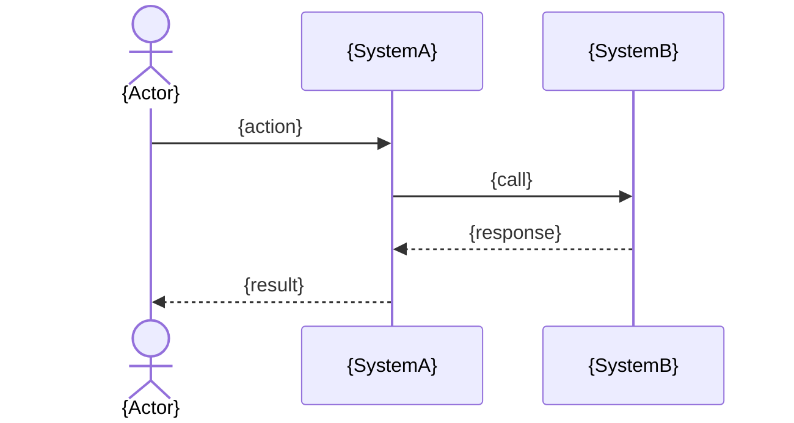

# SRS Flows — {module_slug}

> Module/system-level flow diagrams only. UC-level diagrams belong in `usecases/diagrams.md`.

## Flow: {flow-slug}

**Scope:** {module or cross-module scope — must not introduce cross-module behavior outside backbone}
**Linked UCs:** UC-{slug}
**Linked Backbone IDs:** {backbone-id}

```mermaid
flowchart TD
  A[{start}] --> B[{step}]
  B --> C{decision}
  C -->|yes| D[{outcome}]
  C -->|no| E[{outcome}]
```

## Flow: {flow-slug-2}

**Scope:** {scope}


