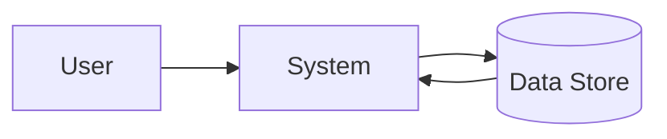
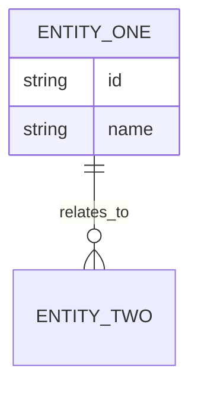

# Software Requirements Specification

**Project:** [Project name]
**Version:** [v1.0]
**Owner:** [BA/technical owner]
**Date:** [YYYY-MM-DD]

## Purpose and Scope
State the software scope, boundaries, and intended readers.

## Overall Description
- Product perspective:
- User classes:
- Operating environment:
- Assumptions and dependencies:

## Functional Requirements
| ID | Requirement | Priority | Source | Acceptance Criteria |
| --- | --- | --- | --- | --- |
| FR-01 | [Requirement] | [Must/Should/Could] | [Source] | [AC] |

## Use Case Specifications
Document the main system interactions in actor-goal format. One row per use case, then expand critical use cases below.

| Use Case ID | Use Case Name | Primary Actor | Trigger | Precondition | Postcondition |
| --- | --- | --- | --- | --- | --- |
| UC-01 | [Use case] | [Actor] | [Trigger] | [Precondition] | [Postcondition] |

### Detailed Use Case
**Use Case ID:** [UC-01]
**Goal:** [What the actor achieves]
**Primary Actor:** [Actor]
**Supporting Actors/Systems:** [Optional]
**Preconditions:** [What must already be true]
**Postconditions:** [What is true after completion]

| Step | Actor Action | System Response |
| --- | --- | --- |
| 1 | [Actor action] | [System response] |

**Alternate Flows**
- [Variation or exception]

**Business Rules**
- [Rule reference]

**Acceptance Notes**
- [What must be validated]

## Screen Descriptions
Capture screen-level behavior, navigation, fields, and validation expectations for any UI-backed scope.

| Screen ID | Screen Name | Purpose | Primary User | Entry Point | Exit/Next Step |
| --- | --- | --- | --- | --- | --- |
| SCR-01 | [Screen] | [Purpose] | [User] | [How user arrives] | [Where user goes next] |

### Screen Detail
**Screen ID:** [SCR-01]
**Pencil Artifact:** `designs/[initiative-slug]/SCR-01-[screen-name].pen`
**Artifact Scope:** [Single screen / multiple screens / end-to-end flow]
**Layout Summary:** [Key regions, panels, or sections]
**Navigation Rules:** [Menu, breadcrumbs, modal, back/next behavior]

## Wireframe / Mockup Reference
- Pencil file: `designs/[initiative-slug]/SCR-01-[screen-name].pen`
- Covered screen IDs: [SCR-01, SCR-02]
- Last updated: [YYYY-MM-DD]

## Wireframe Intent
Explain what the wireframe is optimizing for, such as data entry speed, guided completion, review-before-submit, or dashboard scanning.

## Screen Regions
| Region | Purpose | Contents |
| --- | --- | --- |
| Header | [Purpose] | [Title, breadcrumb, status] |
| Main Content | [Purpose] | [Form, table, detail panel] |
| Action Area | [Purpose] | [Primary and secondary actions] |

## Low-Fidelity Wireframe
Use the Pencil `.pen` artifact as the primary wireframe. Add a lightweight text sketch here only when it improves clarity for reviewers who are reading the markdown alone.

```text
+--------------------------------------------------+
| Header: Title / Breadcrumb / Status              |
+----------------------+---------------------------+
| Left Panel           | Main Content              |
| Navigation / Filters | Form fields / table       |
|                      |                           |
|                      | [Primary CTA] [Cancel]    |
+----------------------+---------------------------+
| Footer / Help / Audit Info                       |
+--------------------------------------------------+
```

| Field/Control | Type | Required | Validation | Source/Default | Notes |
| --- | --- | --- | --- | --- | --- |
| [Field] | [Input/Dropdown/Button] | [Yes/No] | [Rule] | [Default/source] | [Notes] |

**User Actions**
- [Primary action]
- [Secondary action]

**Error and Empty States**
- [State and expected behavior]

**State Variants**
- Loading: [Expected UI state]
- Empty: [Expected UI state]
- Success: [Expected UI state]
- Error: [Expected UI state]
- Disabled/Read-only: [Expected UI state]

**Permission and Visibility Rules**
- [Which roles can view or act on which controls]

**Responsive Notes**
- Desktop: [Layout behavior]
- Tablet: [Layout behavior]
- Mobile: [Layout behavior]

**Linked Use Cases / Requirements**
- Use cases: [UC-01, UC-02]
- Requirements: [FR-01, FR-02, BR-01]

**Accessibility or UX Notes**
- [Relevant constraints]

## Non-Functional Requirements
| ID | Category | Requirement | Target |
| --- | --- | --- | --- |
| NFR-01 | Performance | [Requirement] | [Target] |

## Data Flow Diagrams


## Entity Relationship Diagram


## API Specifications
- Endpoint:
- Method:
- Request schema:
- Response schema:
- Error handling:

## Constraints
- Technical constraints:
- Regulatory constraints:
- Operational constraints:

## Test Cases
| ID | Scenario | Expected Result | Priority |
| --- | --- | --- | --- |
| TC-01 | [Scenario] | [Expected result] | [Priority] |

## Glossary
| Term | Definition |
| --- | --- |
| [Term] | [Definition] |

## Related Templates
- [FRD Template](./frd-template.md)
- [Gap Analysis Template](./gap-analysis-template.md)
- [Change Impact Template](./change-impact-template.md)
