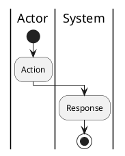

# Use Case Canon Template

## Frontmatter

```yaml
---
artifact_type: usecase-canon
uc_id: UC-xxx
uc_name: [Use Case Name]
module_slug: [module-slug]
status: draft
primary_actor: [Actor]
diagram_type: activity
screens_involved: [SCR-XXX-01]
trace:
  user_stories: [US-001]
  functional_requirements: [FR-module-001]
  business_rules: [BR-module-001]
---
```

## Goal

- Business outcome:
- User outcome:

## Actors

- Primary actor:
- Supporting actors/systems:

## Preconditions

- [Condition]

## Trigger

- [Trigger]

## Main Flow

1. [Actor/system step]
2. [Actor/system step]

## Alternate And Exception Flows

- A1. [Alternate flow]
- E1. [Exception flow]

## Postconditions

- Success outcome:
- Failure outcome:

## Diagram

Use one primary diagram only unless two different questions genuinely need two views.



## Screens Involved

| screen_id | purpose |
| --- | --- |
| SCR-XXX-01 | [Purpose] |

## Trace Links

| trace_type | ids |
| --- | --- |
| user_stories | [US-001] |
| functional_requirements | [FR-module-001] |
| business_rules | [BR-module-001] |

## Open Questions

- [ ] OQ-01: [Question]
