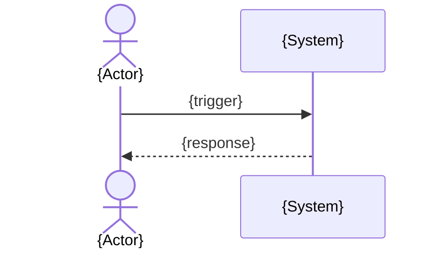

# Use Case Diagrams — {module_slug}

> UC-level diagrams only. Module/system flow diagrams belong in `srs/flows.md`.

## UC-{module}-{slug}: {use case title}

```mermaid
sequenceDiagram
  actor {Actor}
  participant {System}
  {Actor}->>{System}: {trigger}
  {System}-->>{Actor}: {response}
```

## UC-{slug2}: {use case title}

```mermaid
sequenceDiagram
  actor {Actor}
  participant {System}
  {Actor}->>{System}: {trigger}
  {System}-->>{Actor}: {response}
```
