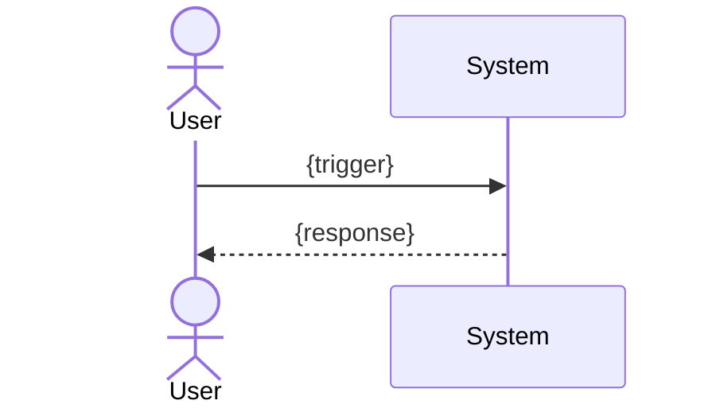

# UC-{slug}: {use case title}

## Actors

- Primary: {actor}
- Secondary: {actor} (if applicable)

## Preconditions

- {precondition 1}

## Trigger

{What initiates this use case.}

## Main Flow

1. {step 1 — actor action}
2. {step 2 — system response}
3. {step 3}

## Alternate Flows

### AF-01: {alternate scenario}

1. {step}

## Error / Exception Flows

### EF-01: {error scenario}

1. {step}
2. System shows {MSG-ERR-NN}.

## Postconditions

- {postcondition 1}

## Diagram

## Trace

- User stories: {US-NNN}
- Backbone feature: {feature ID}
- Screens: {SCR-01}

## Open Questions

- [ ] OQ-1: {question}
